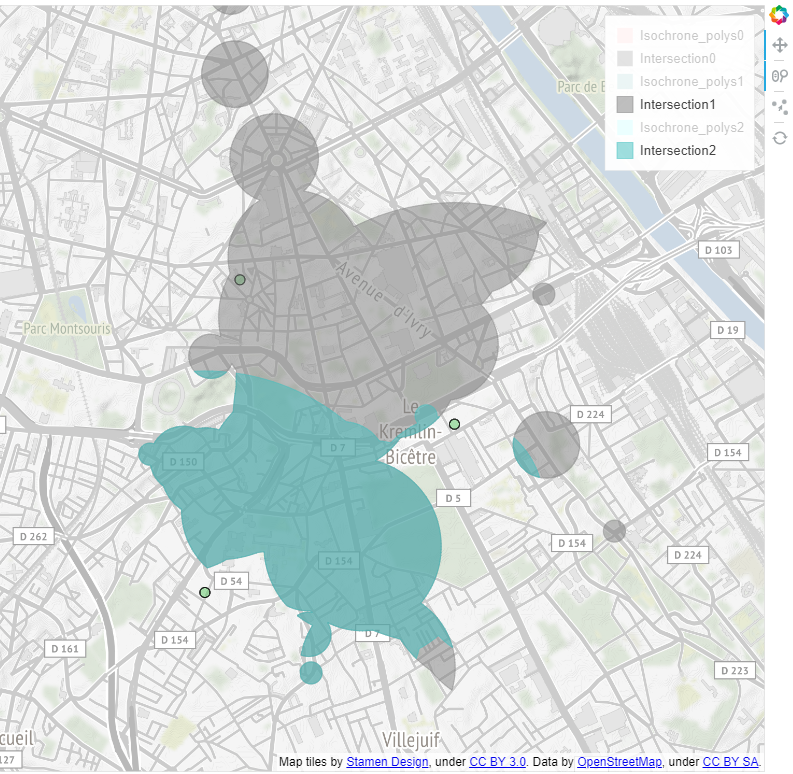

# app_iso
# Development of an isochrones visualisation app

## Installation steps
### Clone the repo
- Clone the Github repository and use the iso_design branch

### Python packages
- Install required Python packages using requirements.txt file
- This command should work (*if not conda or pip install the 11 packages*)
```
while read requirement; do conda install --yes $requirement; done < requirements.txt
```

### Navitia token
- You have to use a token to use Navitia API
- So you need to register [here](https://www.navitia.io/register/) to get a token
- Create a file named "*.env*" in the "*code*" directory ... (*see figure*)

- ... with only one line in it (*never push your .env file on Github !*):

```
NAVITIA_TOKEN=""
```
- Put your Navitia token between the quotation marks and save your file

## Running the Bokeh app
- Then open a Anaconda command prompt (*or a system command prompt but with access to the right anaconda python environment*) and write:
```
cd [path/to/app_iso/directory]
bokeh serve code
```
- Bokeh server will start running and you should see something like this in the command prompt:
```
2018-05-24 14:13:56,529 Starting Bokeh server version 0.12.14 (running on Tornado 4.5.3)
2018-05-24 14:13:56,532 Bokeh app running at: http://localhost:5006/code
2018-05-24 14:13:56,539 Starting Bokeh server with process id: 50804
```
- Then in your browser, go to http://localhost:5006/code
- You should see this: 
- You should see this in command prompt:
```
2018-05-24 15:12:11,345 200 GET /code (::1) 1114.46ms
2018-05-24 15:12:11,650 101 GET /code/ws?bokeh-protocol-version=1.0&bokeh-session-id=D4EU0HRjtcutsalbFuqdZ6GpubyO60UWGzmlXkJeJjvh (::1) 0.99ms
2018-05-24 15:12:11,651 WebSocket connection opened
2018-05-24 15:12:11,653 ServerConnection created
```
- If there are errors please report them (*error messages should appear in the command prompt*)

## Usage / controls

### 
1. Pan tool: pan on the map
2. Zoom tool: use the mouse wheel to zoom on map
3. Node tool: use this to add point, as departure (*instead of adress*), on map. Use it with the Point button (*see IV.1.*)

### 
1. Selection of region (*Navitia coverage*)
2. Enter a date for the request
3. Enter an adress. Use it with the Adress button (*see IV.2.*)
4. Enter a time constraint for the request
5. Enter a duration for the request

### 
1. Use Points button if you want shape with points contours (*MultiPoints*)
2. Use Lines button if you want only contours MultiPolygons
3. Use Polygons button if you want MultiPolygons

### 
1. Use Point button with Node tools to add point on map (*see I.3.*)
2. Use Adress button if you want to use adress methode (*see II.3.*)

### 
1. Tab to choose between color sliders or Viridis colors. In Viridis tab, you can choose between 5 colorblindness accessible colors
2. RGB Red slider to set red value
3. RGB Green slider to set green value
4. RGB Blue slider to set blue value
5. Opacity slider to set the opacity value

### 
1. This slider could be used to change tiles opacity

### 
1. Intersection button: measure the intersection between 2 or more isochrone shapes
2. Union button: join 2 or more isochrones to get one unique isochrone
3. Difference button: make a symmetric difference between 2 or more isochrones

### 
> ***This settings will only be applied to the last generetad overlay.***

1. Tab to switch between colors settings and contour size setting
2. Overlay_contour button: use to change contour color with COLOR CHOICE tools
3. Overlay_background button: use to change background color with COLOR CHOICE tools

### 
1. RUN button: run the app after set all the parameters (*MultiPoints*)
2. EXPORT button: export the map to PNG or SVG (*no tiles*)
3. RESET button: reset the map (*NOT WORKING FOR NOW, use a refresh instead*)

### LEGEND
* You can hide/show layer by clicking on it in the control panel:


## Known issues
- Impossible geolocation with some adresses (*no error message for now, only empty map*)
- Reset button make the side controls panel to disappear (*bug: currently work on it*)
- Export button/function needs to be debugged (*known Bokeh problems with svg/png exports when using map tiles*)
- Code needs a serious cleaning
- Bokeh doesn't support MultiPolygons with holes (*need to find a workaround*)
