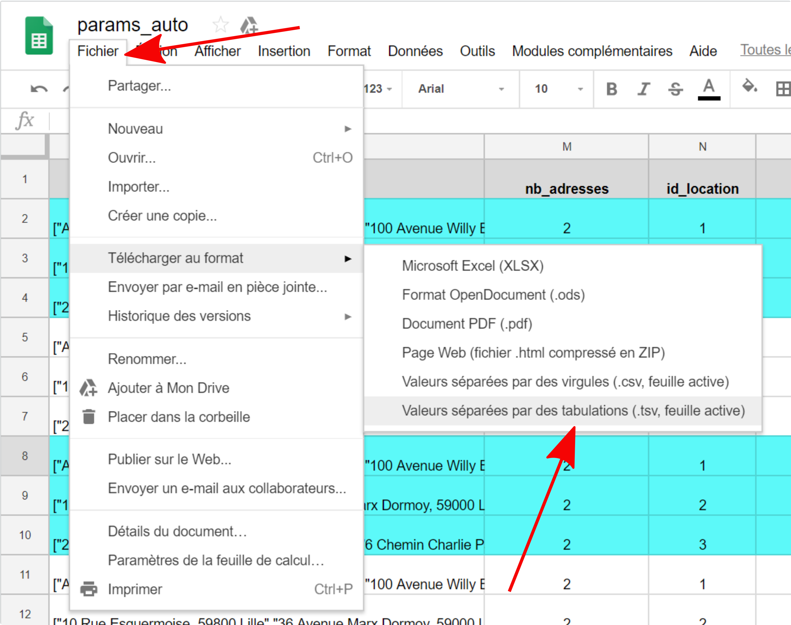
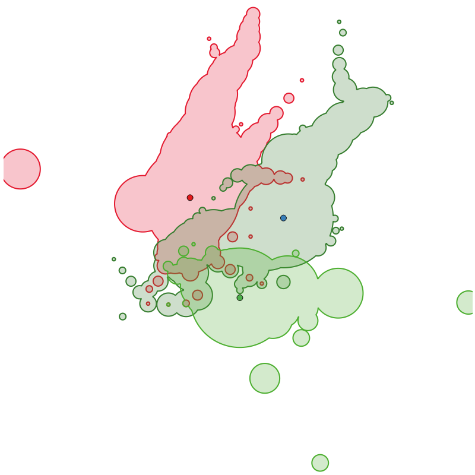
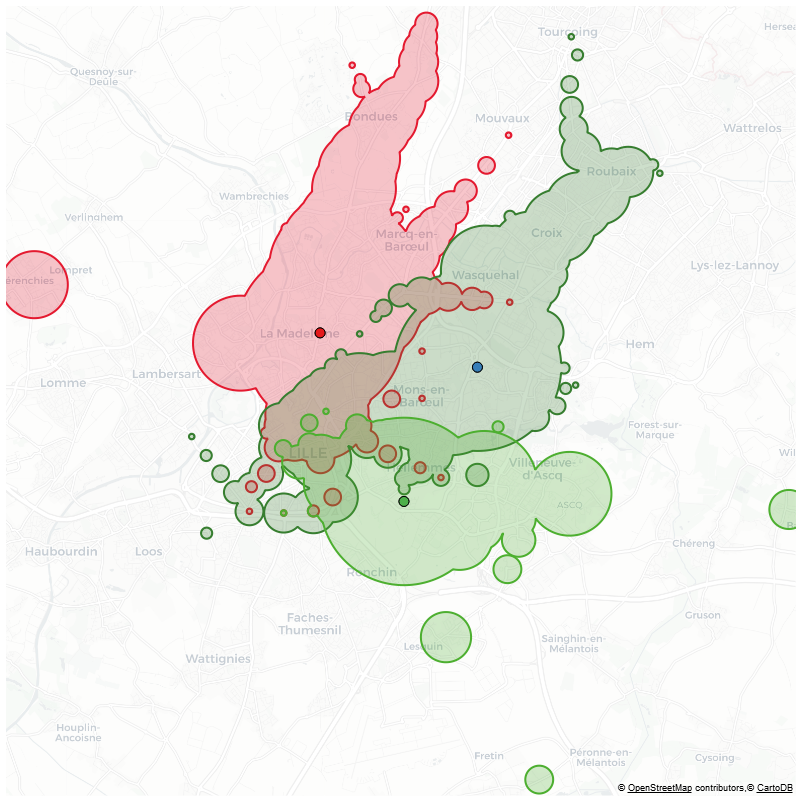
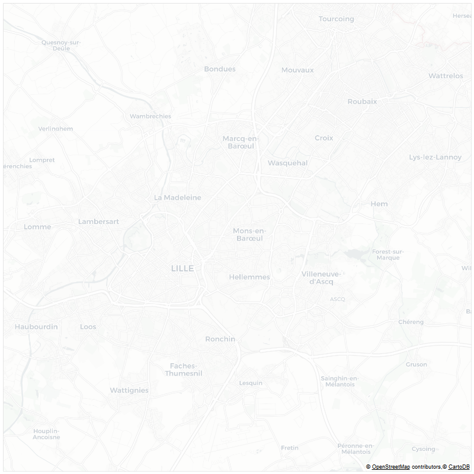

# App_iso
> **USE WITH PYTHON 3.6**

# Development of an isochrones visualisation app
This is an experimental application using [Python Bokeh](https://bokeh.pydata.org/en/latest/) to visualize transit Isochrones (*measured using [Navitia API](http://doc.navitia.io/#isochrones), based on [GTFS](https://en.wikipedia.org/wiki/General_Transit_Feed_Specification)*) and their intersections. It is used to test various designs (*shapes, colors, contours, backgrounds, ...*) in order to determine the most accessible designs for isochronic shapes's intersections.  

> ***WARNING:*** this application is a work in progress.

## Installation steps
### Clone the repo
- Clone:
```
git clone -b iso_design https://github.com/sical/app_iso.git
```
- or download the iso_design branch repository

### Python packages
- Install required Python packages using requirements.txt file
- If you want to use conda, you need to add channel ```conda-forge```. In anaconda prompt: ```conda config --append channels conda-forge```
- Then this command should work (*if not conda or pip install the 11 packages*)
```
while read requirement; do conda install --yes $requirement; done < requirements.txt
```

### Navitia token
- You have to use a token to use Navitia API
- So you need to register [here](https://www.navitia.io/register/) to get a token
- Create a file named "*.env*" in the "*code*" directory ... (*see figure*)


- ... with only one line in it (*never push your .env file on Github !*):

```
NAVITIA_TOKEN=""
```
- Put your Navitia token between the quotation marks and save your file

## Running the Bokeh app [*MAJOR CHANGES FOR AUTOMATE SCRIPT, NEED TO BE CHECKED*]
- Then open a Anaconda command prompt (*or a system command prompt but with access to the right anaconda python environment*) and write:
```
cd [path/to/app_iso/directory]
bokeh serve code
```
- Bokeh server will start running and you should see something like this in the command prompt:
```
2018-05-24 14:13:56,529 Starting Bokeh server version 0.12.14 (running on Tornado 4.5.3)
2018-05-24 14:13:56,532 Bokeh app running at: http://localhost:5006/code
2018-05-24 14:13:56,539 Starting Bokeh server with process id: 50804
```
- Then in your browser, go to http://localhost:5006/code
- You should see this:


- You should see this in command prompt:
```
2018-05-24 15:12:11,345 200 GET /code (::1) 1114.46ms
2018-05-24 15:12:11,650 101 GET /code/ws?bokeh-protocol-version=1.0&bokeh-session-id=D4EU0HRjtcutsalbFuqdZ6GpubyO60UWGzmlXkJeJjvh (::1) 0.99ms
2018-05-24 15:12:11,651 WebSocket connection opened
2018-05-24 15:12:11,653 ServerConnection created
```
- If there are errors please report them (*error messages should appear in the command prompt*)

## Usage / controls

### 
1. Pan tool: pan on the map
2. Zoom tool: use the mouse wheel to zoom on map
3. Node tool: use this to add point, as departure (*instead of adress*), on map. Use it with the Point button (*see IV.1.*)

### 
1. Selection of region (*Navitia coverage*)
2. Enter a date for the request
3. Enter an adress. Use it with the Adress button (*see IV.2.*)
4. Enter a time constraint for the request
5. Enter a duration for the request

### 
1. Use Points button if you want shape with points contours (*MultiPoints*)
2. Use Lines button if you want only contours MultiPolygons
3. Use Polygons button if you want MultiPolygons

### 
1. Use Point button with Node tools to add point on map (*see I.3.*)
2. Use Adress button if you want to use adress methode (*see II.3.*)

### 
1. Tab to choose between color sliders or Viridis colors. In Viridis tab, you can choose between 5 colorblindness accessible colors
2. RGB Red slider to set red value
3. RGB Green slider to set green value
4. RGB Blue slider to set blue value
5. Opacity slider to set the opacity value

### 
1. This slider could be used to change tiles opacity

### 
1. Intersection button: measure the intersection between 2 or more isochrone shapes
2. Union button: join 2 or more isochrones to get one unique isochrone
3. Difference button: make a symmetric difference between 2 or more isochrones

### 
> ***This settings will only be applied to the last generetad overlay.***

1. Tab to switch between colors settings and contour size setting
2. Overlay_contour button: use to change contour color with COLOR CHOICE tools
3. Overlay_background button: use to change background color with COLOR CHOICE tools

### 
1. RUN button: run the app after set all the parameters (*MultiPoints*)
2. EXPORT button: export the map to PNG or SVG (*no tiles*)
3. RESET button: reset the map (*NOT WORKING FOR NOW, use a refresh instead*)

### LEGEND
* You can hide/show a layer by clicking on it in the control panel:


## PARAMS folder
> ***WARNING:*** The parameters files need to be cleaned, possible useless parameter settings.

In the ```./code/params/``` folder, there is a JSON file named ```params.json```. This file is used to set projections and some of default design parameters.

```JSON
{
	"proj": {
		"inProj": "epsg:4326",
		"outProj": "epsg:3857"
	},
	"fig_params": {
		"width": 800,
		"height": 800,
		"alpha_tile": 0.5,
		"alpha_surf": 0.5,
		"alpha_cont": 0.85,
		"alpha_building": 0.0,
		"alpha_network": 0.6,
		"color_network": "black",
		"line_width_surf": 0.5,
		"line_width_cont": 4,
		"line_width_building": 1,
		"field": "time"
	}
}
```

There is also a default parameters file named ```default.json``` in the same folder. This file is used to set the default app's parameters.

```JSON
{
	"from_place":"2.349900;48.842021",
	"adress":"79 Rue Mouffetard, 75005 Paris",
	"time_":"08:00",
	"modes":"TRANSIT,WALK",
	"max_dist":"800",
	"step":1200,
	"nb_iter":"3",
	"year_min":2018,
	"month_min":5,
	"day_min":17,
	"year_max":2019,
	"month_max":5,
	"day_max":31
}
```

## Running the automate script
It is also possible to use a script ```./code/automate.py``` that generates PNG files from a JSON input parameters file.

### How to use it
* Elaborate a sheet with all the parameters (*see [here](#explanations-of-parameters-for-automation-of-calculation)*)
* Save it as .csv or .tsv (*see [here](#how-to-proceed-with-google-sheets) how to proceed with Google Sheet*)
* Open a cmd prompt, go to the directory containing the automate.py script
* Run the automate.py script: ```python automate.py infile_csv outfile_json separator``` where:
 	* *infile_csv* is the csv/tsv file path name with all the parameters
	* *outfile_json* is the json file path name you want to create (*json file from infile_csv*)
	* *separator* is the separator used in *infile_csv*
==> *example*:  ```python automate.py "./params/params_auto - test_min.tsv" "./params/test.json" "\t"```
* If everything is fine, you will notice a progress bar that will be updated

### Explanations of parameters for automation of calculation

| Name                      |  Details                                                            | Type                 |Example                 |
|:--------------------------|:--------------------------------------------------------------------|:------------------------| :------------------------|
| **id**                    | name_iso + "location_" + nb_adresses + id_location, automatic build | str |*iso_type_1-location_2_1* |
| **name_tech**             | name of the technique to use, used to name the results files | str | *Intersection_AlphaBlending_Uncalculated* |
| **name_iso**              | name of the iso type used, linked to the used technique | str | *iso_type_1* |
| **how**                   | overlay technique (*intersection, difference, symmetric_difference, union*) | str | *intersection* |
| **colors_iso**            | list of hex colors for isochrone, number must be equal to number of addresses | list of str | *["#ff0000","#0000ff"]* |
| **colors_intersection**   | hex color for intersection | str | *ffffff* |
| **opacity_isos**          | opacity level for isochrone (range between 0.0 and 1.0) | float | *0.3* |
| **opacity_intersection**  | opacity level for intersection (range between 0.0 and 1.0) | float | *0.3* |
| **shape**                 | type of shape (poly, line, ...) | str | *poly* |
| **region_id**             | region to specify coverage for API request | str | *fr-idf* |
| **date**                  | date for the request (format YYYY-MM-DD) | str | *2018-06-02* |
| **adresses**              | list of addresses | list of str | *["Gare Part-Dieu - Vivier Merle 69003 Lyon", "La Doua - Gaston Berger 69100 Villeurbanne"]* |
| **nb_adresses**           | number of adresses in list (used for id) | int | *2* |
| **id_location**           | id for location (group of addresses, used for id) | int | *1* |
| **time**                  | time for the request (format HH:MM:SS) | str | *08:00:00* |
| **jump**                  | 2 values for "jumping" through time (*first number for interval between 2 jumps in minutes , second number for number of "jumps"*), 0 for no jump | str | *60,2* |
| **duration**              | duration for isochrone request (minutes). 0 if durations not empty | int | *20* |
| **durations**             | durations for isochrone request (minutes). [] if duration | list of int | *[10,20,30]* |
| **step**                  | step value (1 for a duration of 20 mns will make 20 isochrones: 1mn, 2 mn, 3 mn, ...). 0 for no step | int | *1* |
| **simplify**							|	method to add simplified isochrone (simplify, convex or envelope), default None | str | *convex* |
| **tolerance**							|	tolerance number for simplify method (higher is the number, greater is the simplification), default 50 | int | *100* |
| **preserve_topology**			|	preserve or not the topology (*1 => yes, 0 => no*), default 1 | int | *1* |
| **excluded_modes**				|	list of modes you want to exclude, default [] (*empty list*), (*see [here](#Modes)*) for possibilities | list of str | *["Metro","RapidTransit"]* |
| **buffer_radar**         	|	determine if a buffer radar is added to the figure (0 => No, 1 => Yes, default 0) | int | 0 |
| **around**         	      |	determine if a buffer is used to get points around origin to search for differences if points is moved from *x* meters ([distance in meters, precision]). Leave blank if you don't want to use it | list of int | *100,3* |
| **origine_screen**        | 1 if origine on map, 0 if not (*only works on maps with tiles*) | int | *1* |
| **only_overlay**          | 1 if only overlay on map, 0 if not | int | *1* |
| **only_buffer**           | 1 if only buffers and no isochrone, 0 if not | int | *1* |
| **buffer_times**          | list of string lists to set duration for each buffer in minutes | list of str | *["10,20,30", "10,20,30"]* |
| **buffer_opacity**        | list of floats to manage opacity. **For now, must set same opacity for each buffer** | list of floats | *[0.5, 0.5]* |
| **buffer_color**          | list of hex colors for buffers, number must be equal to number of addresses | list of str | *["#ff0000","#0000ff"]* |
| **buffer_contour_size**   | list of string lists with contour width for each buffer | list of str | *["0.5,1.0,2.0", "0.5,1.0,2.0"]* |
| **export_no_tiles**       |	Path (relative or absolute) to directory for no-tiles images (*use // to separate*) | str | *.//output_png//tests//no_tiles//* |
| **export_with_tiles**     |	Path (relative or absolute) to directory for with-tiles images (*use // to separate*) | str | *.//output_png//tests//with_tiles//* |
| **export_anim**           |	Path (relative or absolute) to directory for animation export (*use // to separate*) | str | *.//output_png//tests//anim//* |
| **inProj**                |	epsg for input coordinates (*from Navitia API*) | str | *epsg:4326* |
| **outProj**               |	epsg for output coordinates (*to be used with Bokeh*) | str | *epsg:3857* |
| **width**                 |	width of the plot in pixels  | int | *800* |
| **height**                |	height of the plot in pixels  | int | *800* |
| **alpha_tile**            |	opacity for tiles | float | *0.8* |
| **alpha_surf**            |	opacity for polygons | float | *0.8* |
| **alpha_cont**            |	opacity for polylines | float | *0.8* |
| **alpha_building**        |	opacity for building layer | float | *0.8* |
| **alpha_network**         |	opacity for network layer | float | *0.8* |
| **color_network**         |	color for network | str | *#0000ff* |
| **line_width_surf**       |	contour size for polygons | int | *2* |
| **line_width_surf**       |	contour size for polylines | int | *2* |
| **line_width_building**   |	contour size for buildings | int | *1* |
| **distance_bbox**         |	distance in meters to measure a bounding box around a centroid | int | *15000* |

##### Modes
> ***API is case sensitive so respect lowercase and uppercase.***
> ***Available modes may vary regarding the region, to check the avalaible physical modes for a specific region, you can use this request:***
```https://[YOUR NAVITIA TOKEN]@api.navitia.io/v1/coverage/[REGION ID]/physical_modes```

Here is the modes you can choose to exclude:
 * Bike
 * BikeSharingService
 * Bus
 * Car
 * Funicular
 * Metro
 * RapidTransit
 * Tramway
 * VAL
 * CheckIn
 * CheckOut
 * Ferry
 * Train
 * Air
 * Coach
 * LocalTrain
 * Shuttle
 * Tram
 * Rail
 * LongDistanceTrain
 * PrivateVehicle
 * Trolleybus

 Some explanations for some modes:
 * RapidTransit refers to heavy transit like Paris RER
 * VAL refers to automatic subway
 * LocalTrain refers to french TER for example
 * LongDistanceTrain refers to high speed train

#### How to proceed with Google sheets
* Set your parameters into a new sheet (based on examples and on the [readme](https://github.com/sical/app_iso/tree/iso_design#explanations-of-parameters-for-automation-of-isochrones-calculation))
* Save your sheet to tsv and put the .tsv file to ```./code/params/```


#### Outputs
* ***no_tiles***: directory with files with no tiles in background:
	* *png*: image files
	* *svg*: vector files that can be opened with Inkscape or Illustrator for example
	* *json*: intersections json file when `duration` parameter is used and when there is no `step`, `jump` and `around` (*need to be improved*). Here is the json structure:
		* `id` => id of parameters
		* `parameters` => parameters used (*not all of them*)
		* `stats` => some measures on intersections (*work in progress*). Divided in two parts:
			* `details` => details on polygons that compose the intersection
			* `synthesis` => synthesis on intersections: total area and number of Polygons
		* *See the example below:*


``` JSON
	[
 {
	 "id": 0,
	 "parameters": {
		 "color": "#4daf4a",
		 "color_switch": null,
		 "durations": [],
		 "how": "intersection",
		 "id": 0,
		 "nb_iter": 1,
		 "opacity_intersection": "None",
		 "opacity_iso": 0.25,
		 "simplify": "None",
		 "step": 1800,
		 "step_mn": 0,
		 "str_modes": "",
		 "time_in": "08:00",
		 "tolerance": 10,
		 "topology": false
	 },
	 "stats": {
		 "details": {
			 "amplitude": {
				 "0": 0
			 },
			 "area": {
				 "0": 0
			 },
			 "complexity": {
				 "0": 0
			 },
			 "convex": {
				 "0": 0
			 },
			 "nb_vertices": {
				 "0": null
			 },
			 "norm_notches": {
				 "0": 0
			 },
			 "perimeter": {
				 "0": 0
			 }
		 },
		 "synthesis": {
			 "area_sum": 0,
			 "nb_poly": 0
		 }
	 }
 },
 {
	 "id": 2,
	 "parameters": {
		 "color": "#4daf4a",
		 "color_switch": null,
		 "durations": [],
		 "how": "intersection",
		 "id": 2,
		 "nb_iter": 1,
		 "opacity_intersection": "None",
		 "opacity_iso": 0.25,
		 "simplify": "None",
		 "step": 1800,
		 "step_mn": 0,
		 "str_modes": "",
		 "time_in": "08:00",
		 "tolerance": 10,
		 "topology": false
	 },
	 "stats": {
		 "details": {
			 "amplitude": {
				 "0": -1.707805986e-16
			 },
			 "area": {
				 "0": 35260.564966859
			 },
			 "complexity": {
				 "0": -4.126965987e-17
			 },
			 "convex": {
				 "0": -2.063482993e-16
			 },
			 "nb_vertices": {
				 "0": 181
			 },
			 "norm_notches": {
				 "0": 0
			 },
			 "perimeter": {
				 "0": 665.6894204727
			 }
		 },
		 "synthesis": {
			 "area_sum": 35260.564966859,
			 "nb_poly": 1
		 }
	 }
 }
]
```
* ***with_tiles***: directory with files with tiles in background:
	* *png*: image files (*no svg as tiles can not be transformed to vectors*)
* ***only_tiles***: directory with files with only tiles:
	* *png*: image files (*no svg as tiles can not be transformed to vectors*)
* ***All the files with same name in the 3 directories have the same bounding box***
  

## Known issues
- Impossible geolocation with some adresses (*no error message for now, only empty map*)
- Reset button make the side controls panel to disappear (*bug: currently work on it*)
- Export button/function needs to be debugged (*known Bokeh problems with svg/png exports when using map tiles*)
- Code needs a serious cleaning
- Bokeh doesn't support MultiPolygons with holes (*need to find a workaround*)
