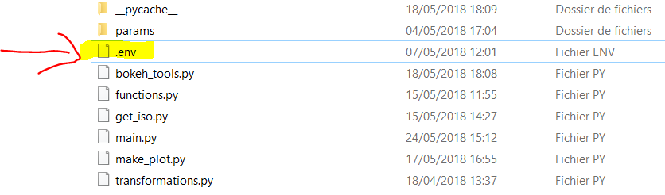
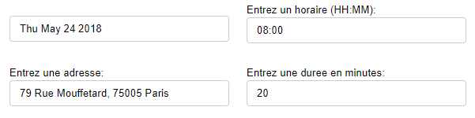
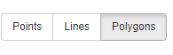
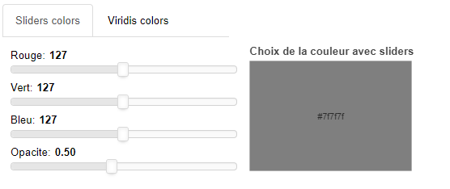
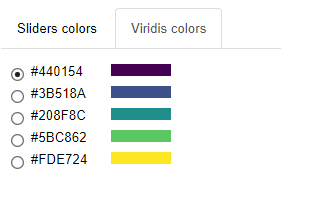
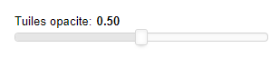
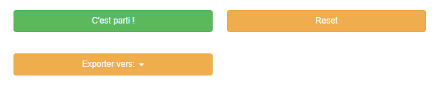
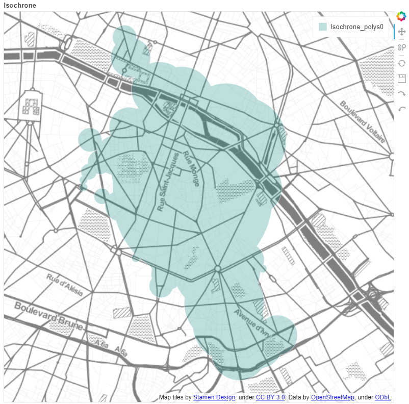

# app_iso
# Development of an isochrones visualisation app

## Installation steps
### Clone the repo
- Clone the Github repository and use the iso_design branch

### Python packages
- Install required Python packages using requirements.txt file
- This command should work (*if not conda or pip install the 11 packages*)
```
while read requirement; do conda install --yes $requirement; done < requirements.txt
```

### Navitia token
- You have to use a token to use Navitia API
- So you need to register [here](https://www.navitia.io/register/) to get a token
- Create a file named "*.env*" in the "*code*" directory ... (*see figure*)

- ... with only one line in it (*never push your .env file on Github !*):

```
NAVITIA_TOKEN=""
```
- Put your Navitia token between the quotation marks and save your file

## Running the Bokeh app
- Then open a Anaconda command prompt (*or a system command prompt but with access to the right anaconda python environment*) and write:
```
cd [path/to/app_iso/directory]
bokeh serve code
```
- Bokeh server will start running and you should see something like this in the command prompt:
```
2018-05-24 14:13:56,529 Starting Bokeh server version 0.12.14 (running on Tornado 4.5.3)
2018-05-24 14:13:56,532 Bokeh app running at: http://localhost:5006/code
2018-05-24 14:13:56,539 Starting Bokeh server with process id: 50804
```
- Then in your browser, go to http://localhost:5006/code
- You should see this: 
- You should see this in command prompt:
```
2018-05-24 15:12:11,345 200 GET /code (::1) 1114.46ms
2018-05-24 15:12:11,650 101 GET /code/ws?bokeh-protocol-version=1.0&bokeh-session-id=D4EU0HRjtcutsalbFuqdZ6GpubyO60UWGzmlXkJeJjvh (::1) 0.99ms
2018-05-24 15:12:11,651 WebSocket connection opened
2018-05-24 15:12:11,653 ServerConnection created
```
- If there are errors please report them (*error messages should appear in the command prompt*)

## Usage
- Here you can choose a date, adress, time and duration:

- You can choose between MultiPoints, MultiPolygons and MultiLines:

- You chan choose to use any color using Sliders colors ...

- ... or colorblindness colors using Viridis colors

- Tile opacity could be used anytime you want (*update when sliding*)

- Click on "C'est parti !" button to get the isochrone

- You should get something like this (you chan show/hide layer by clicking on it in legend):


## Known issues
- Only this side controls are usable (*Pan/Drag and Scroll/Pich*) (*tests with others but not working as wanted for now*):

- Impossible geolocation with some adresses (*no error message for now, only empty map*)
- Reset button make the side controls panel to disappear (*bug: currently work on it*)
- Export button/function needs to be debugged (*known Bokeh problems with svg/png exports when using map tiles*)
- Code needs a serious cleaning
- Some isochrones are not correctly shown on map (*probably a Navitia API issue because it is a beta version*)
- Bokeh doesn't support MultiPolygons with holes (*need to find a workaround*)
