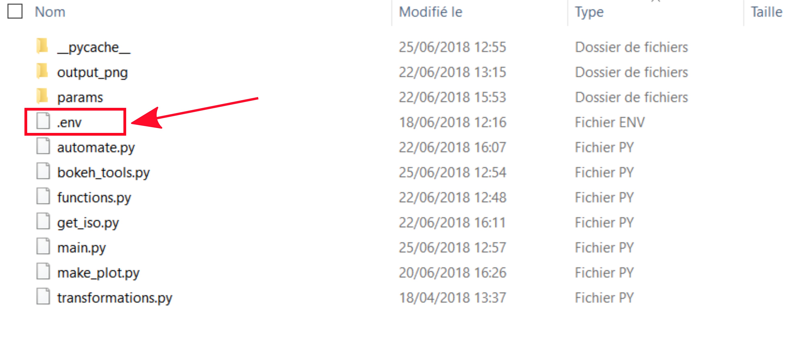
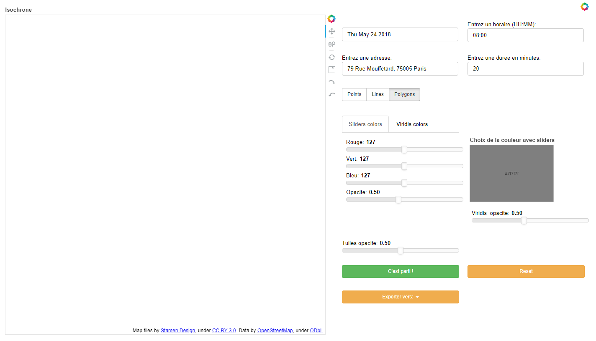

# app_iso
# Development of an isochrones visualisation app

## Installation steps
### Clone the repo
- Clone the Github repository and use the iso_design branch

### Python packages
- Install required Python packages using requirements.txt file
- This command should work (*if not conda or pip install the 11 packages*)
```
while read requirement; do conda install --yes $requirement; done < requirements.txt
```

### Navitia token
- You have to use a token to use Navitia API
- So you need to register [here](https://www.navitia.io/register/) to get a token
- Create a file named "*.env*" in the "*code*" directory ... (*see figure*)

- ... with only one line in it (*never push your .env file on Github !*):

```
NAVITIA_TOKEN=""
```
- Put your Navitia token between the quotation marks and save your file

## Running the Bokeh app
- Then open a Anaconda command prompt (*or a system command prompt but with access to the right anaconda python environment*) and write:
```
cd [path/to/app_iso/directory]
bokeh serve code
```
- Bokeh server will start running and you should see something like this in the command prompt:
```
2018-05-24 14:13:56,529 Starting Bokeh server version 0.12.14 (running on Tornado 4.5.3)
2018-05-24 14:13:56,532 Bokeh app running at: http://localhost:5006/code
2018-05-24 14:13:56,539 Starting Bokeh server with process id: 50804
```
- Then in your browser, go to http://localhost:5006/code
- You should see this: 
- You should see this in command prompt:
```
2018-05-24 15:12:11,345 200 GET /code (::1) 1114.46ms
2018-05-24 15:12:11,650 101 GET /code/ws?bokeh-protocol-version=1.0&bokeh-session-id=D4EU0HRjtcutsalbFuqdZ6GpubyO60UWGzmlXkJeJjvh (::1) 0.99ms
2018-05-24 15:12:11,651 WebSocket connection opened
2018-05-24 15:12:11,653 ServerConnection created
```
- If there are errors please report them (*error messages should appear in the command prompt*)

## Usage / controls

### <span style="color:#440154"> I. MAP </span>
* <span style="color:#440154">1. Pan tool: pan on the map</span>
* <span style="color:#440154">2. Zoom tool: use the mouse wheel to zoom on map</span>
* <span style="color:#440154">3. Node tool: use this to add point, as departure (<i>instead of adress</i>), on map. Use it with the Point button (<i>see IV.1.</i>)</span>

### <span style="color:#472B7A"> II. API PARAMETERS </span>
* <span style="color:#472B7A">1. Selection of region (<i>Navitia coverage</i>)</span>
* <span style="color:#472B7A">2. Enter a date for the request</span>
* <span style="color:#472B7A">3. Enter an adress. Use it with the Adress button (<i>see IV.2.</i>)</span>
* <span style="color:#472B7A">4. Enter a time constraint for the request</span>
* <span style="color:#472B7A">5. Enter a duration for the request</span>

### <span style="color:#3B518A"> III. SHAPE CHOICE </span>
* <span style="color:#3B518A">1. Use Points button if you want shape with points contours (<i>MultiPoints</i>)</span>
* <span style="color:#3B518A">2. Use Lines button if you want only contours MultiPolygons</span>
* <span style="color:#3B518A">3. Use Polygons button if you want MultiPolygons</span>

### <span style="color:#2C718E"> IV. POINT/ADRESS </span>
* <span style="color:#2C718E">1. Use Point button with Node tools to add point on map (<i>see I.3.</i>)</span>
* <span style="color:#2C718E">2. Use Adress button if you want to use adress methode (<i>see II.3.</i>)</span>

### <span style="color:#208F8C"> V. COLOR CHOICE </span>
* <span style="color:#208F8C">1. Tab to choose between color sliders or Viridis colors. In Viridis tab, you can choose between 5 colorblindness accessible colors</span>
* <span style="color:#208F8C">2. RGB Red slider to set red value</span>
* <span style="color:#208F8C">3. RGB Green slider to set green value</span>
* <span style="color:#208F8C">4. RGB Blue slider to set blue value</span>
* <span style="color:#208F8C">5. Opacity slider to set the opacity value</span>

### <span style="color:#27AD80"> VI. TILES OPACITY </span>
* <span style="color:#27AD80">1. This slider could be used to change tiles opacity</span>

### <span style="color:#5BC862"> VII. OVERLAY TYPES </span>
* <span style="color:#5BC862">1. Intersection button: measure the intersection between 2 or more isochrone shapes</span>
* <span style="color:#5BC862">2. Union button: join 2 or more isochrones to get one unique isochrone</span>
* <span style="color:#5BC862">3. Difference button: make a symmetric difference between 2 or more isochrones</span>

### <span style="color:#AADB32"> VIII. OVERLAY ASPECT </span>
> ***This settings will only be applied to the last generetad overlay.***

* <span style="color:#AADB32">1. Tab to switch between colors settings and contour size setting</span>
* <span style="color:#AADB32">2. Overlay_contour button: use to change contour color with COLOR CHOICE tools</span>
* <span style="color:#AADB32">3. Overlay_background button: use to change background color with COLOR CHOICE tools</span>

### <span style="color:#FDE724"> IX. RUN/RESET/EXPORT </span>
* <span style="color:#FDE724">1. RUN button: run the app after set all the parameters (<i>MultiPoints</i>)</span>
* <span style="color:#FDE724">2. EXPORT button: export the map to PNG or SVG (<i>no tiles</i>)</span>
* <span style="color:#FDE724">3. RESET button: reset the map (<i>NOT WORKING FOR NOW, use a refresh instead</i>)</span>

### LEGEND
* You can hide/show layer by clicking on it in the control panel:
 

## Known issues
- Impossible geolocation with some adresses (*no error message for now, only empty map*)
- Reset button make the side controls panel to disappear (*bug: currently work on it*)
- Export button/function needs to be debugged (*known Bokeh problems with svg/png exports when using map tiles*)
- Code needs a serious cleaning
- Bokeh doesn't support MultiPolygons with holes (*need to find a workaround*)
