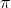
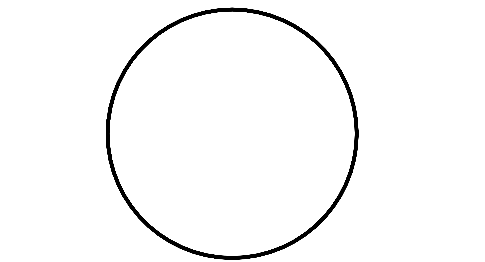
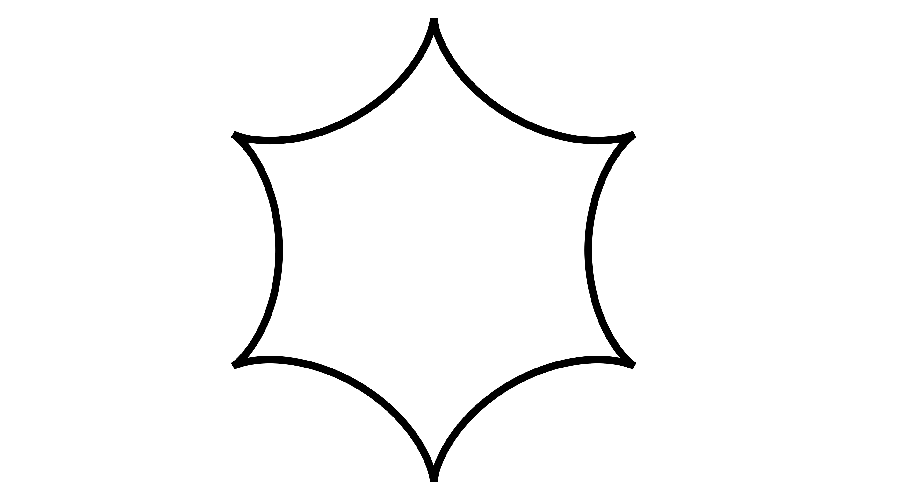
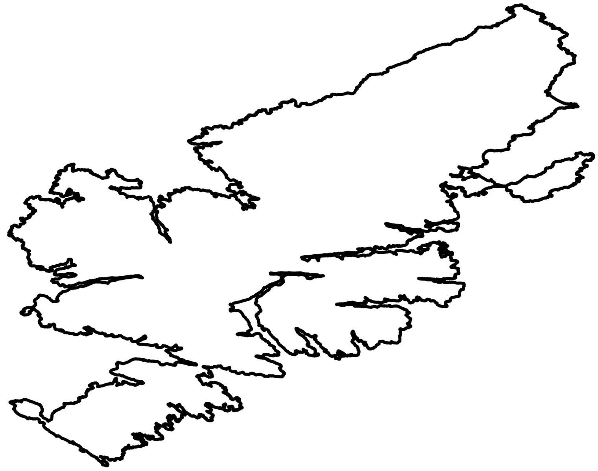
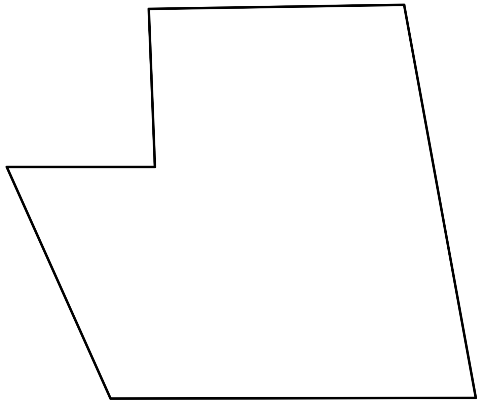
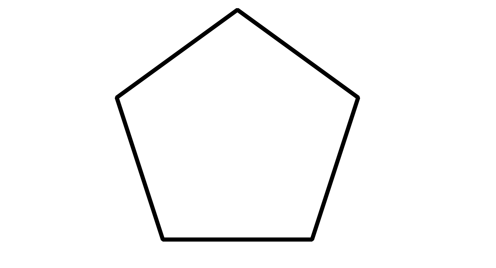
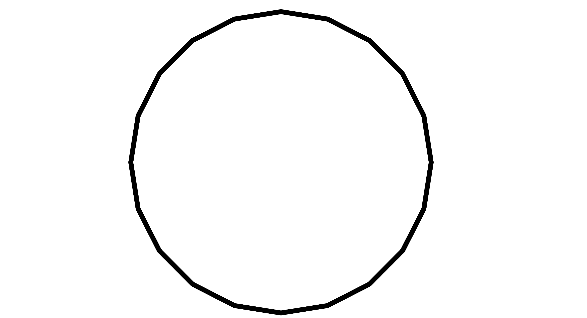

# Measures of polygon's complexity
## Intro
In order to measure the complexity of polygons, we studied a paper and a QGIS plugin (*not working in QGIS LTR 2.18**) based on this paper:
  *   Brinkhoff, Thomas, Hans-Peter Kriegel, Ralf Schneider, et Alexander Braun., [*Measuring the Complexity of Polygonal Objects*](https://www.google.fr/url?sa=t&rct=j&q=&esrc=s&source=web&cd=1&cad=rja&uact=8&ved=0ahUKEwiar5SdlrzbAhVFPxQKHY-MCsMQFggtMAA&url=http%3A%2F%2Fciteseerx.ist.psu.edu%2Fviewdoc%2Fdownload%3Fdoi%3D10.1.1.73.1045%26rep%3Drep1%26type%3Dpdf&usg=AOvVaw1J5RsuN2NBeZbzNHkbouF_).
  * [QGIS plugin](https://github.com/pondrejk/PolygonComplexity) by [Peter Ondrejka](https://github.com/pondrejk)

We develop functions to measure the complexity and functions to export results as statistical tables (*with possibility to chose the export format: html, latex, ...*) included in the *complexity* module.

> There's the possibility to generate random polygons using ***main_generator***. This script will generate *.shp* files and *.png* files that could be used for complexity measures. The script plays with 3 parameters (*script based on this [source](https://stackoverflow.com/questions/8997099/algorithm-to-generate-random-2d-polygon), by Mike Ounsworth*):
  >* irregularity,
  >* spikeyness,
  >* number of vertices

> These parameters can be changed using *params.json* in *params* directory.

> ***WARNING***: this script needs more tests (especially to block the rendering of figures in Ipython console and avoid this kind of warning:
```
RuntimeWarning: More than 20 figures have been opened.
Figures created through the pyplot interface (`matplotlib.pyplot.figure`) are retained until explicitly closed and may consume too much memory.
(To control this warning, see the rcParam `figure.max_open_warning`).
 max_open_warning, RuntimeWarning)
```
## Calculation
Find parameters to quantify/qualify the complexity of a polygon:
* Number of polygon
* Area
* Perimeter
* Number of vertices or edges
* Centroid
* Frequency of vibration (*normalized notches*) (**see paper**):
"*Measure the vibration of polygon’s boundary. “Notches describe the non-convex parts of a polygon. The maximum number of notches that occur on a polygon pol depend on its number of vertices*." Notches are vertex where an interior angle larger than :

  > 

* "*The fewer notches that occur, the smoother the boundary is. If notchesnorm is 0, the polygon is convex. Similar to low values of notches norm, high values indicate a smooth boundary*"
* Amplitude (*ampl*) of  polygon (*pol*) vibration (**see paper**):
"*The frequency of the vibration makes no statement with respect to the intensity of the vibration. In order to quantify this amplitude, we investigate the increase of the boundary of the polygon compared to the boundary of its convex hull*":

  > 

* Deviation from convex hull (**see paper**):
"*The two parameters introduced before describe the local vibration of a spatial object. The global shape of a spatial object is however another aspect that intuitively influences the rating of the complexity of the spatial object. In order to obtain a measure for this type of global complexity, we use the convex hull of the polygon again*":

  > 

* Complexity (**see paper**):
  > 

## Structure of directory
If you git clone the project, you will have everything you need.
If you want to make changes, you have to keep the following instructions in mind.
In order to use the *complexity* functions, you have to have a directory with:
  * main.py (*configuration*)
  * complexity.py (*main module*)
  * subdirectory **images** (*images files with a specific name that matches with shape name*)
  * subdirectory **shapes** (*shapefiles with a specific name that matches with image name*):
    * example for shapes directory: 
    * example for images directory: 

## Export to table format
We use the *tabulate* Python module to generate table with these potential formats (*see [tabulate doc](https://pypi.org/project/tabulate/) for more information*):
* "plain"
* "simple"
* "github"
* "grid"
* "fancy_grid"
* "pipe"
* "orgtbl"
* "jira"
* "presto"
* "psql"
* "rst"
* "mediawiki"
* "moinmoin"
* "youtrack"
* "html"
* "latex"
* "latex_raw"
* "latex_booktabs"
* "textile"

For example, we use these parameters to get a markdown table with links to images:

```python
import glob
from complexity import complexity, to_table

coeff_ampl = 0.8
coeff_conv = 0.2

columns = ["img","name","complexity","convex","freq","nbvertices","notches","perimeter"]

if __name__ == "__main__":
    shapes = glob.glob("./shapes/*.shp")
    images = glob.glob("./images/*.png")
    coeff_ampl, coeff_conv = 0.8, 0.2
    filename = "complexity.md"
    tablefmt = "github"
    str_img_latex = "\includegraphics[width=1cm]{{figures/{}}}"
    str_img = ""

    gdf, dico = complexity(shapes, coeff_ampl, coeff_conv, images=images, str_img=str_img)
    table = to_table(gdf, tablefmt, str_img, filename=filename, columns=columns)
```
> for *str_img* parameter, you'll need to check the format and string that matches your needs. In the example, it is set for markdown table format.


## Examples

> Below is a table with results on some polygons (*from [shapes](https://github.com/sical/app_iso/tree/iso_design/code/experiments/complexity/shapes) and [images](https://github.com/sical/app_iso/tree/iso_design/code/experiments/complexity/images) folders*)

| img                                  | name               |   complexity |       convex |     freq |   nbvertices |   notches |    perimeter |
|--------------------------------------|--------------------|--------------|--------------|----------|--------------|-----------|--------------|
|        | circle_800_m       |  0           |  0           | 0.997623 |           61 |  0.482759 |  7647.75     |
|  | ellipse-rose_800_m |  0.772325    |  0.489042    | 0.99975  |         3581 |  0.49441  | 48537.1      |
|    | epicycloid_800_m   |  0.110421    |  0.0511481   | 0.999752 |          721 |  0.494429 |  8504.67     |
|                | fohr               |  0.0433539   |  0.0565209   | 0.999496 |           66 |  0.507937 |     0.49061  |
|   | hypocycloid_800_m  |  0.145616    |  0.32818     | 0.99986  |          721 |  0.495822 |  8099.99     |
|       | isle_of_lewis      |  0.640704    |  0.293321    | 0.912794 |        37781 |  0.394409 |    13.7218   |
|               | notch              |  0.0427433   |  0.0801176   | 0.5625   |            7 |  0.25     |     0.727923 |
|     | pentagone_800_m    |  2.65334e-17 |  1.32667e-16 | 0        |            6 |  0        |  7141.68     |
|           | pie_800_m          |  0           |  0           | 0.1296   |           13 |  0.9      |  3279.95     |
|      | polyfoil_800_m     |  0.129277    |  0.159125    | 0.999007 |          721 |  0.488858 |  8447.36     |
|  | quasi-circle_800_m |  1.45874e-16 | -2.04153e-16 | 0.975461 |           21 |  0.444444 |  7602.81     |
|        | square_800_m       |  0           |  0           | 0        |            5 |  0        |  6873.16     |
|      | star_400_800_m     |  0.154585    |  0.445042    | 0.308642 |           15 |  0.166667 | 10049.4      |
