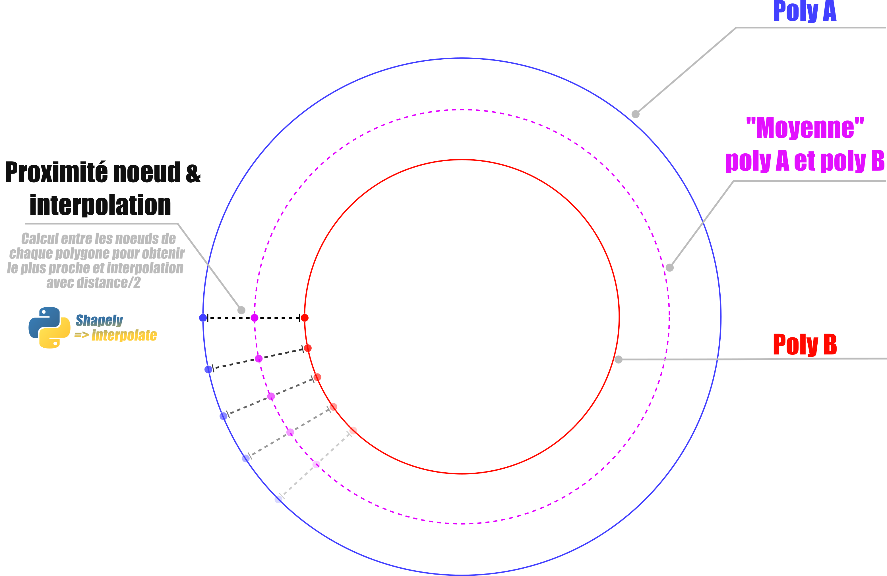

# Calcul d'un polygon moyen entre 2 polygones

> Nécessité de calculer un polygone "*moyen*" entre plusieurs polygones

## Première approche: distance minimale et interpolation entre 2 polygones
*Base*: 2 polygones **A** et **B** avec **B** inclus dans **A**

*Méthode*: Itération sur chaque paire de polygones pour trouver le polygone moyen (*cf. schéma ci-après*)

*Libs*: ***Shapely*** avec la méthode ***[interpolate](http://toblerity.org/shapely/manual.html#object.interpolate)***

{width=10%}
